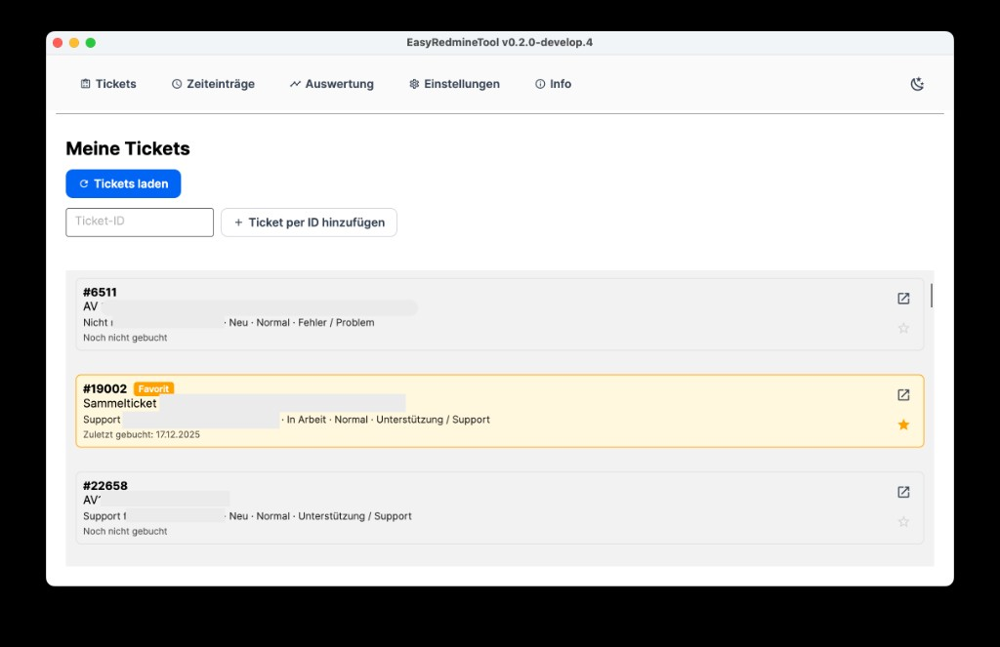
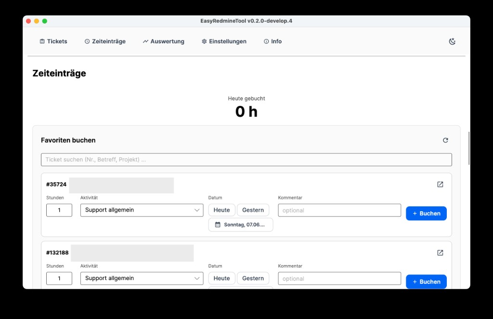
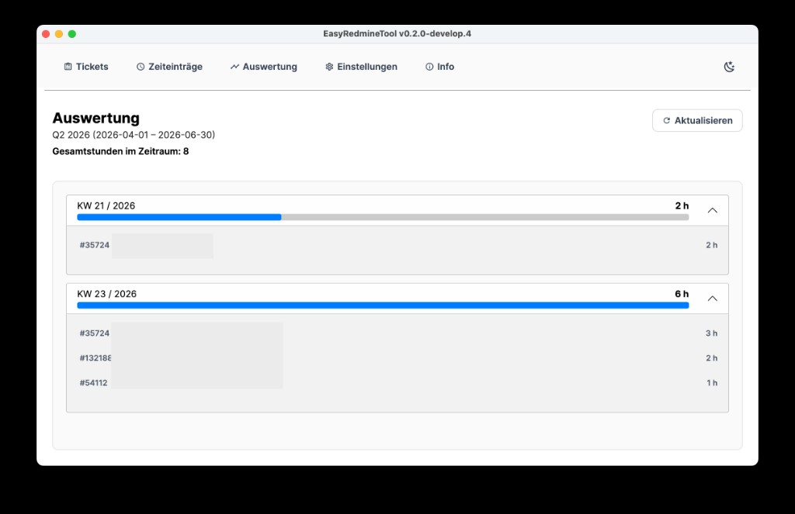
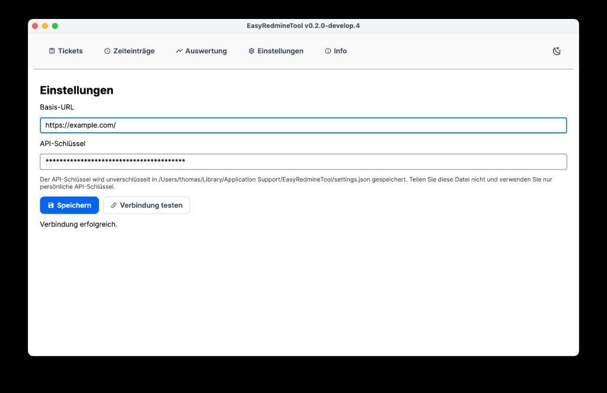
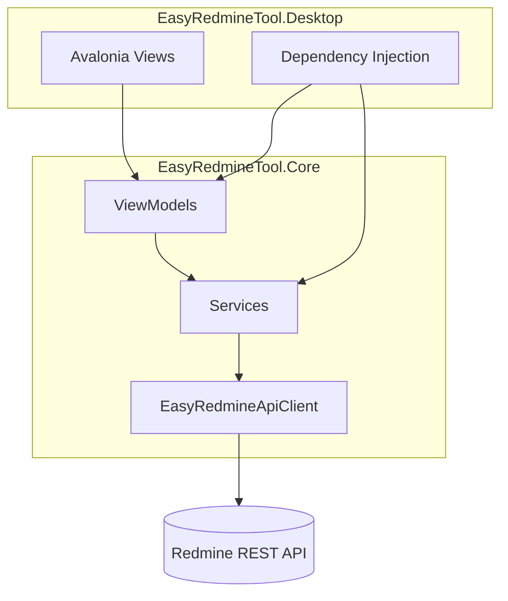

# EasyRedmineTool

[](https://github.com/tom4711/EasyRedmineTool/actions/workflows/ci.yml)
[](https://dotnet.microsoft.com/)
[](https://avaloniaui.net/)
[](LICENSE)
[](https://avaloniaui.net/)

Desktop-Anwendung für **Redmine** und **Easy Redmine**: offene Tickets verwalten, Zeiteinträge schnell buchen und Arbeitszeiten auswerten — ohne Browser-Tab-Chaos.

> **Hinweis:** API-Schlüssel und Einstellungen werden ausschließlich lokal im Benutzerverzeichnis gespeichert. Niemals Zugangsdaten in Code oder Git committen.

---

## Screenshots

### Ticketliste
Offene und zuletzt gebuchte Tickets laden, Favoriten markieren und direkt in Redmine öffnen.



### Zeiteinträge
Favoriten-Tickets buchen — Stunden, Aktivität, Datum und Kommentar; heutige Gesamtstunden oben.



### Auswertung
Quartalsübersicht nach Kalenderwochen mit Ticket-Aufschlüsselung; Klick springt zur Zeiteingabe.



### Einstellungen
Basis-URL und API-Schlüssel hinterlegen, Verbindung testen und speichern — alles nur lokal im Benutzerverzeichnis.



---

## Funktionen

| Bereich | Beschreibung |
|---------|--------------|
| **Ticketliste** | Offene und kürzlich gebuchte Tickets laden, nach ID ergänzen, in Redmine öffnen |
| **Favoriten** | Häufig genutzte Tickets markieren und sortiert nach letztem Buchungsdatum anzeigen |
| **Zeiteinträge** | Stunden, Aktivität, Datum und Kommentar direkt aus der Favoritenliste buchen; heutige Stunden live |
| **Auswertung** | Quartalsübersicht nach Kalenderwochen inkl. Stunden pro Ticket; Sprung zur Zeiteingabe per Klick |
| **Einstellungen** | Basis-URL, API-Schlüssel, Verbindungstest, Hell/Dunkel-Modus |

---

## Voraussetzungen

- [.NET 10 SDK](https://dotnet.microsoft.com/download)
- Zugang zu einer Redmine-/Easy-Redmine-Instanz
- Persönlicher **API-Schlüssel** (Redmine: *Mein Konto → API-Zugangsschlüssel*)

---

## Schnellstart (Entwicklung)

```bash
git clone https://github.com/tom4711/EasyRedmineTool.git
cd EasyRedmineTool
git checkout develop

dotnet restore EasyRedmineTool.slnx
dotnet build
dotnet test
dotnet run --project src/EasyRedmineTool.Desktop
```

Beim ersten Start öffnet sich die **Einstellungen**-Ansicht. Dort Basis-URL und API-Schlüssel eintragen, speichern und den Verbindungstest ausführen.

---

## Konfiguration

Alle Einstellungen liegen **nur im Benutzerverzeichnis** — nicht neben der Anwendung und nicht im Repository:

| Plattform | Pfad |
|-----------|------|
| **macOS** | `~/Library/Application Support/EasyRedmineTool/settings.json` |
| **Windows** | `%AppData%\EasyRedmineTool\settings.json` |
| **Linux** | `~/.config/EasyRedmineTool/settings.json` *(je nach System)* |

Gespeichert werden u. a.:

- Basis-URL der Redmine-Instanz
- API-Schlüssel
- Zwischengespeicherte Ticketliste
- Favoriten und Vorlage für den letzten Zeiteintrag

---

## Sicherheit

- Der API-Schlüssel wird **unverschlüsselt** in `settings.json` abgelegt.
- Die Datei gehört nur in dein Benutzerprofil — **nicht** in Cloud-Sync-Ordner oder Git.
- Verwende einen persönlichen Schlüssel mit den **minimal nötigen Rechten**.
- Nach Deinstallation bleibt `settings.json` erhalten, bis du sie manuell löschst.
- **Keine Secrets in ViewModels, Tests oder Commits** — nur Platzhalter wie `"secret"` in Unit-Tests.

---

## Architektur



| Projekt | Rolle |
|---------|-------|
| `EasyRedmineTool.Desktop` | Avalonia-UI, Styles, Einstiegspunkt |
| `EasyRedmineTool.Core` | ViewModels, Services, API-Client, Modelle |
| `EasyRedmineTool.Tests` | Unit-Tests für Kernlogik |

**Tech-Stack:** Avalonia 12 · CommunityToolkit.Mvvm · Microsoft.Extensions.DependencyInjection / Http / Logging · Material Icons

---

## Tests

```bash
dotnet test EasyRedmineTool.slnx
```

Abgedeckt u. a.: Einstellungen (`AppSettingsService`), Datums-Helfer (`RedmineDates`), Ticket-Lookup und API-Pagination.

---

## Git nach History-Rewrite

Wurde die Branch-Historie neu geschrieben (z. B. nach Entfernen versehentlich committeter Secrets), auf anderen Rechnern:

```bash
git fetch origin
git checkout develop
git reset --hard origin/develop
```

Lokale `settings.json` im Benutzerverzeichnis ist davon **nicht** betroffen.

---

## Release (Windows)

Releases werden automatisch erstellt, wenn auf `main` ein Tag im Format `v*` gepusht wird (z. B. `v1.0.0`):

```bash
git checkout main
git pull origin main
git tag v1.0.0
git push origin v1.0.0
```

Der [Release-Workflow](.github/workflows/release.yml) führt Tests aus, baut ein **Windows x64**-Paket (self-contained ZIP) und veröffentlicht es als GitHub Release zum Download. Vorab-Versionen (`v1.0.0-beta.1`) werden als Pre-Release markiert.

---

## Weitere Dokumentation

- [Redmine Time-Entries API (Referenz)](docs/API-TimeEntries.md)

---

## Lizenz

[MIT License](LICENSE) — Copyright © 2026 Thomas Menzl
